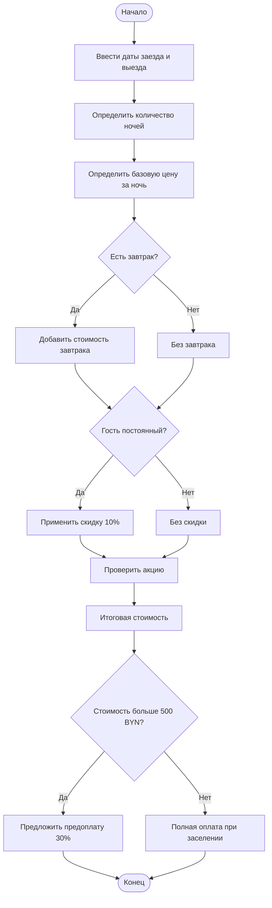

# Flowchart: Алгоритм расчёта стоимости бронирования

```mermaid
flowchart TD
    A([Начало]) --> B[Ввести даты заезда и выезда]
    B --> C[Определить количество ночей]
    C --> D[Определить базовую цену за ночь]
    D --> E{Есть завтрак?}
    E -- Да --> F[Добавить стоимость завтрака]
    E -- Нет --> G[Без завтрака]
    F --> H{Гость постоянный?}
    G --> H
    H -- Да --> I[Применить скидку 10%]
    H -- Нет --> J[Без скидки]
    I --> K1[Проверить акцию]
    J --> K1
    K1 --> K[Итоговая стоимость]
    K --> L{Стоимость больше 500 BYN?}
    L -- Да --> M[Предложить предоплату 30%]
    L -- Нет --> N[Полная оплата при заселении]
    M --> O([Конец])
    N --> O
```

