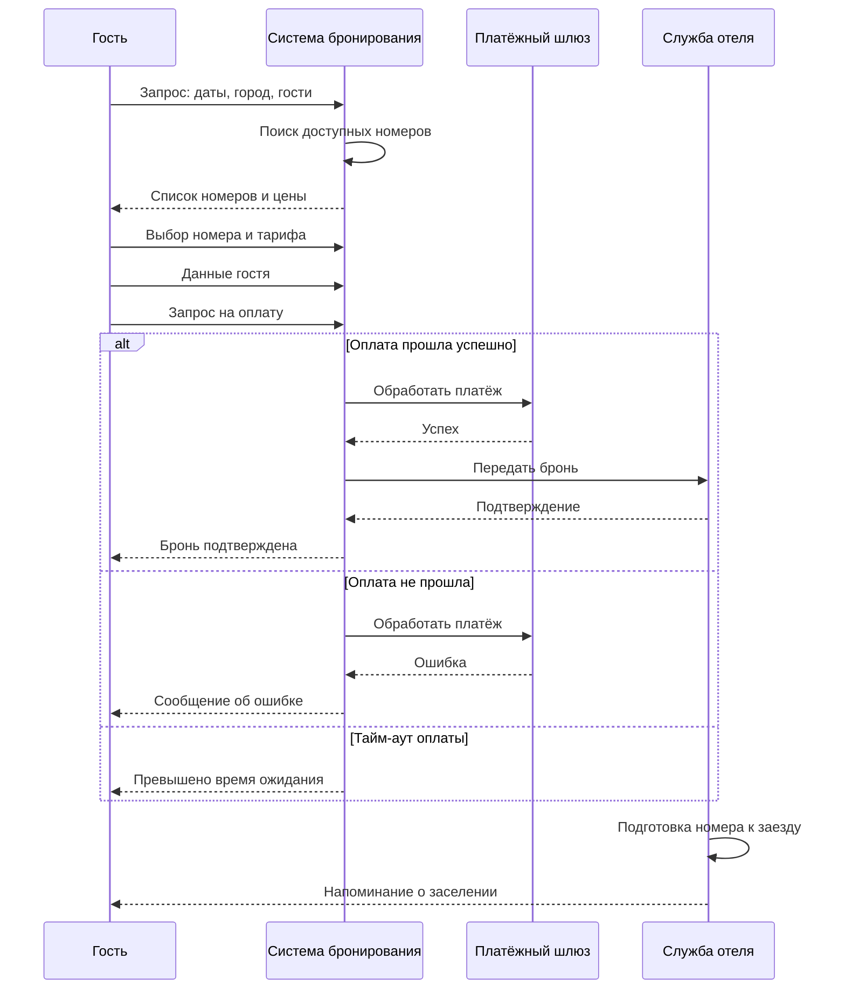

# Sequence Diagram: Бронирование номера в отеле

```mermaid
sequenceDiagram
    participant G as Гость
    participant S as Система бронирования
    participant P as Платёжный шлюз
    participant H as Служба отеля

    G->>S: Запрос: даты, город, гости
    S->>S: Поиск доступных номеров
    S-->>G: Список номеров и цены
    G->>S: Выбор номера и тарифа
    G->>S: Данные гостя
    G->>S: Запрос на оплату

    alt Оплата прошла успешно
        S->>P: Обработать платёж
        P-->>S: Успех
        S->>H: Передать бронь
        H-->>S: Подтверждение
        S-->>G: Бронь подтверждена
    else Оплата не прошла
        S->>P: Обработать платёж
        P-->>S: Ошибка
        S-->>G: Сообщение об ошибке    
    else Тайм-аут оплаты
        S-->>G: Превышено время ожидания
    end

    H->>H: Подготовка номера к заезду
    H-->>G: Напоминание о заселении
```

